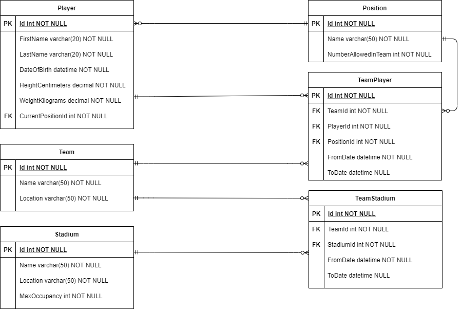

# Rugby Union Management System

<h2>About</h2>

This project is a REST API build using ASP.NET Core 3.1 and C#. This API exposes CRUD endpoints for the following entities:

* Position
* Team
* Player
* Stadium

The CRUD endpoints that are exposed for each entity are:

* GET 		/{entity}/{id}
* GET 		/{entity}?offset=0&pageSize=10
* POST 		/{entity}
* PUT 		/{entity}
* DELETE 	/{entity}/{id}

In addition to the basic CRUD operations above, the API also exposes the following endpoints:

* POST		/player/{playerId}/transfer/team/{teamId}
* GET		/player/{playerId}/team/history
* GET 		/stadium/{stadiumId}/team/history
* POST		/team/{teamId}/add/player/{playerId}
* DELETE	/team/{teamId}/remove/player/{playerId}
* POST		/team/{teamId}/link/stadium/{stadiumId}
* DELETE	/team/{teamId}/unlink/stadium/{stadiumId}
* GET		/team/{teamId}/player/history
* GET		/team/{teamId}/stadium/history

<h2>Assumptions</h2>

I made the following assumptions about the domain:

1.	A player can only belong to one team at a time.
2.	A stadium can only be home to one team at a time.
3.	A team can only have one of each position at a time.
4.	A player can change positions when changing teams.

<h2>How to run the application</h2>

To run the application please checkout the code and run the following commands in the root folder:

<pre>
	<code>
		cd RugbyUnion.ManagementSystem\RugbyUnion.ManagementSystem
		dotnet run --launch-profile "RugbyUnion.ManagementSystem"
	</code>
</pre>

Once launched, you can use [Postman](https://www.postman.com/) to test the API endpoints. A Postan library has been included in this project with tests for each endpoint exposed by this API. This can be found in the file "RugbyUnion.ManagementSystem/postman_collection.json".

<h2>Designs and Interfaces</h2>

The following database design diagrams depicts the database entities used in this API:

The following design of classes was adopted:

1.	A generic CRUD mechanism was created to handle the following operations for any database entity (Team, Player, Stadium, Position):
    
	* Get All – This operation is a paged operation which gets all items from the database. The user can optionally specify and offset, page size and search term.
    * Get – Get a single item from the database
    * Create – Create a single item and save in the database
    * Update – Update an existing item and save to the database
    * Delete – Delete an item from the database by Id.
	
	Should a controller want to expose endpoints for these operations, the controller will need to implement BaseCrudController. BaseCrudController is a generic base controller class which uses a generic CrudService (which implements ICrudService) to provide the operations mentioned above. 

2.	Operations like linking of a team to a stadium or transferring a player from his/her current team to another team is handled is custom services and custom endpoints in a 
	controller.

<h2>List any encountered obstacles and how you solved them</h2>

<h2>List resources used and relevant references</h2>

<h2>How long you took to complete the assignment</h2>

<h2>If you had more time, what would you do differently? Also, what would you have added additionally?</h2>